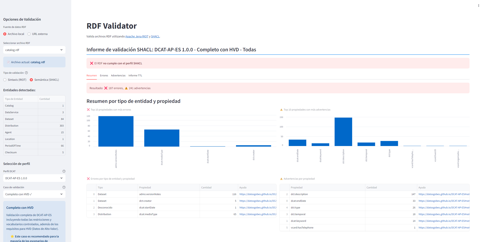

# `easy-rdf-endpoint` - Use Docker to deploy and use a RDF Catalog

## Overview
This project provides a simple **Dockerized RDF endpoint** that serves an `.rdf` file an provides an SPARQL Endpoint based on [`vemonet/rdflib-endpoint`](https://github.com/vemonet/rdflib-endpoint)

* **SPARQL Features**: 
  - Integrated YASGUI editor with multi-tab support
  - Pre-configured example queries
  - Machine-readable SPARQL endpoint

* **Easy Deployment**:
  - Docker and Kubernetes ready
  - Environment-based configuration

* **Security & Performance**:
  - NGINX reverse proxy
  - SSL/TLS support
  - Configurable CORS

* **RDF Catalog Serving**:
  - Serves Catalog `.rdf` files with proper `Content-Type: application/rdf+xml`
  - Compatible with DCAT-AP federators and RDF parsers





## Quick Start
Use [Codespaces](https://github.com/features/codespaces) to test `easy-rdf-endpoint` in your browser
<center><a href='https://codespaces.new/mjanez/easy-rdf-endpoint'></a></center>

## Getting started
**Requirements**:
* [Docker](https://docs.docker.com/get-docker/)

### Clone and configure
Before starting the deployment, you'll need to set up a `.env` file. This file is crucial as it contains environment variables that the application needs to run properly.

1. Clone project
    ```sh
    cd /path/to/my/project
    git clone https://github.com/mjanez/easy-rdf-endpoint.git & cd easy-rdf-endpoint
    ```

2. Push your RDF catalog in folder: ./data 

3. Copy the [`.env.example`](.env.example) template and modify the resulting `.env` to suit your needs.

    ```sh
    cp .env.example .env
    ```

    Adjust the vars as necessary, example the server name if not use `localhost`:
    ```ini
    # Server Configuration
    PROXY_SERVER_NAME=my-example-sparql-server.org

    # RDF of filename in folder ./data 
    CATALOG_FILE=my-custom-catalog.rdf

    # Edit your custom SPARQL queries that load as tabs at startup
    EXAMPLE_SPARQL_QUERIES='{
        "HVD info": {
            "query": "prefix dct: <http://purl.org/dc/terms/>\nprefix dcatap: <http://data.europa.eu/r5r/>\nprefix dcat: <http://www.w3.org/ns/dcat#>\n\nselect distinct ?title ?hvdCategory ?applicableLegislation ?accessService ?accessURL ?license\nwhere {\n  ?catalogo ?cp ?d.\n\n    # Dataset y su categoría HVD\n    ?d dcatap:applicableLegislation <http://data.europa.eu/eli/reg_impl/2023/138/oj>.\n    ?d a dcat:Dataset.\n    optional { ?d dcatap:hvdCategory ?hvdCategory. }\n    \n    # Distribution and its props\n    ?d dcat:distribution ?dist.\n    ?dist dcatap:applicableLegislation <http://data.europa.eu/eli/reg_impl/2023/138/oj>.\n    \n    optional { \n        ?dist dct:title ?title.\n        FILTER(langMatches(lang(?title), \"en\"))\n    } \n    optional { ?dist dcatap:applicableLegislation ?applicableLegislation. } \n    optional { ?dist dcat:accessURL ?accessURL. } \n    optional { ?dist dcat:accessService ?accessService. } \n    optional { ?dist dct:license ?license. } \n}\nORDER BY ?dist"
        },
        "Count stats": {
            "query": "PREFIX rdf: <http://www.w3.org/1999/02/22-rdf-syntax-ns#>\nPREFIX dcat: <http://www.w3.org/ns/dcat#>\nPREFIX dct: <http://purl.org/dc/terms/>\n\nSELECT \n  (COUNT(DISTINCT ?dataset) AS ?totalDatasets)\n  (COUNT(DISTINCT ?distribution) AS ?totalDistributions)\n  (COUNT(DISTINCT ?dataservice) AS ?totalDataservices)\n  (COUNT(DISTINCT ?publisher) AS ?totalPublishers)\nWHERE {\n  {\n    ?dataset a dcat:Dataset .\n    OPTIONAL { ?dataset dct:publisher ?publisher }\n    OPTIONAL { ?dataset dcat:distribution ?distribution }\n  }\n  UNION\n  {\n    ?dataservice a dcat:DataService ;\n                 dcat:servesDataset ?dataset .\n  }\n}"
        },
        "Query types": {
            "query": "PREFIX rdf: <http://www.w3.org/1999/02/22-rdf-syntax-ns#>\nPREFIX rdfs: <http://www.w3.org/2000/01/rdf-schema#>\nPREFIX dct: <http://purl.org/dc/terms/>\nSELECT DISTINCT ?type ?label (COUNT(?s) as ?count) ?comment WHERE {\n    ?s rdf:type ?type .\n    OPTIONAL { ?type rdfs:label ?label }\n    OPTIONAL { ?type rdfs:comment ?comment }\n} \nGROUP BY ?type ?label ?comment\nORDER BY DESC(?count)\nLIMIT 10"
        }
    }' 
    ```

4. Build & up the container.

```sh
docker compose up -d
```

Then, access your RDF file an [endpoints](#endpoints).

---

### Endpoints
The endpoints will be available at:
* Landing page[`http://localhost:5000`](http://localhost:5000)
    * Access your RDF file at: [`http://localhost:5000/catalog`](http://localhost:5000/catalog)
    * Default query editor (Yasgui): [`http://localhost:5000/sparql-editor`](http://localhost:5000/sparql-editor)
    * SPARQL endpoint: [`http://localhost:5000/sparql`](http://localhost5000/sparql)

## Project Structure
```sh
/easy-rdf-endpoint
│── /data/catalog.rdf          # Your Catalog RDF file (replace with your own)
│── /doc/                      # References, as images or documents, used in repo
│── /easy-rdf-endpoint/        # RDF+SPARQL Endpoint setup
│── /nginx/                    # NGINX docker setup
│── /src/                      # Now using NGINX instead of the old RDF serving mode
│── .env.example               # Sample ENVVars file for use with Docker Compose
│── docker-compose.yml         # Docker Compose config
│── README.md                  # Documentation
```

> [!TIP]  
> - Replace `catalog.rdf` with your actual RDF file.  
> - Works with **Codespaces, Docker, Kubernetes, and any containerized environment**.

### Translation
After updating the translation file (`messages.po`), don't forget to compile it to generate the `.mo` file, e.g english:

```sh
cd easy-rdf-endpoint/src/rdf-validator

# Extract i18n texts and update POT
xgettext -d messages --from-code=UTF-8 -o locales/messages.pot app.py

# Compile MO files (english)
msgfmt -o locales/en/LC_MESSAGES/messages.mo locales/en/LC_MESSAGES/messages.po
``` 

## Update SSL Certificate
To update the local SSL certificate, follow these steps:

1. Generate a new certificate and private key:
```sh
openssl req -x509 -nodes -days 365 -newkey rsa:2048 \
  -keyout nginx/setup/easy-rdf-endpoint_local.key \
  -out nginx/setup/easy-rdf-endpoint_local.crt \
  -subj "/C=ES/ST=Madrid/L=Madrid/O=Development/CN=localhost"
```

2. Verify that the files have been created correctly:
```sh
ls -l nginx/setup/easy-rdf-endpoint_local.*
```

3. Restart the `nginx` container to apply the changes:
```sh
docker compose restart nginx
```

> [!CAUTION]
> This certificate is for local development only. In production, use a valid certificate from a certificate authority.

## Development

### Using DevContainers
This project supports development using DevContainers, which provides a consistent development environment for all contributors.

**Requirements**:
* [Docker](https://docs.docker.com/get-docker/)
- [VS Code](https://code.visualstudio.com/) or [GitHub Codespaces](https://github.com/features/codespaces)
- [VS Code Remote - Containers extension](https://docs.rancherdesktop.io/how-to-guides/vs-code-remote-containers/)

#### Getting Started with DevContainer
1. Clone the repository:
```bash
git clone https://github.com/mjanez/easy-rdf-endpoint.git
cd easy-rdf-endpoint
```

2. Open in VS Code:
```bash
code .
```

3. When prompted "*Reopen in Container*", click "*Reopen in Container*". Alternatively:
   - Press `F1`
   - Type "*Remote-Containers: Reopen in Container*"
   - Press *Enter*

VS Code will build and start the development container. This may take a few minutes the first time.

#### What's Included
The development container includes:
- Python 3.11 environment
- Required Python packages pre-installed
- Popular VS Code extensions for Python/Docker development
- Git configuration
- Port forwarding for the application

#### Working in the Container
Once inside the container you can:
- Run the application: `exec gunicorn --bind 0.0.0.0:5000 app:app`
- Modify the [`easy-rdf-endpoint/setup/rdflib-endpoint/sparql_override.py`](./easy-rdf-endpoint/setup/rdflib-endpoint/sparql_override.py)
- Execute SPARQL queries: `http://localhost:5000/sparql`
- Debug with VS Code's integrated debugger

## Image Credits
Some icons used in this project are from:
- [SVG Repo](https://www.svgrepo.com/) under CC Attribution License
- [ckanext-schemingdcat](https://github.com/mjanez/ckanext-schemingdcat) repository

## License
This work is a developed inspired by [rdflib-endpoint](https://github.com/vemonet/rdflib-endpoint) by [Vincent Emonet](https://github.com/vemonet), licensed under [MIT License](https://github.com/vemonet/rdflib-endpoint?tab=MIT-1-ov-file#readme).

This derivative work is licensed under [Creative Commons Attribution 4.0 International License](http://creativecommons.org/licenses/by/4.0/).

